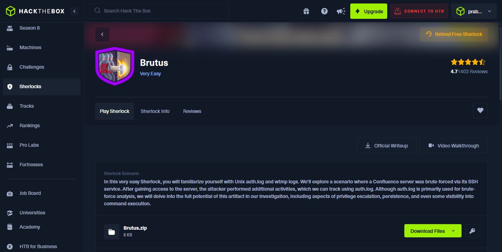

## 🛡️ Brutus (Hack The Box Sherlock) – Introduction

 This Sherlock focuses on defensive investigations and log analysis.
 The scenario simulates an investigation of a Linux server (Confluence)
 that was brute-forced via SSH. The primary artifacts for analysis are:
 - /var/log/auth.log
 - wtmp (login records)

### Objective:
 - Perform an investigation from an incident responder / DFIR perspective.
 - Identify the brute-force activity, timeline, and attacker actions.
 - Find evidence of any privilege escalation, persistence, or command execution.
 - Document findings and recommended remediation.

### Rules / Notes:
 - Approach this exercise like a real-world investigation (chain of custody, timeline).
 - Manual analysis is encouraged; use tools where they add clear value.
 - Deliverables: short executive summary, timeline of events, key evidence screenshots,
   indicators of compromise (IOCs), remediation suggestions.

📷 **Screenshot:** 



---

## 🔍 Step 1: Prepare artifacts & find attacker IP from auth.log (Windows workflow)

### 1) Extract the provided archive (GUI)
 - Open brutus.zip with 7-Zip (or right-click → 7-Zip → Extract).
 - Enter the unzip password provided by the room when prompted.
 Screenshot: screenshots/brutus_01_7zip_extract.png

### 2) Verify extracted files (Windows CMD / Explorer)
 - Using File Explorer you should see two files: auth.log  wtmp
 - Or from a CMD/PowerShell prompt:
dir
 Screenshot: screenshots/brutus_02_dir_contents.png

### 3) Open auth.log in Notepad (or Notepad++)
 - Right-click auth.log → Open with → Notepad (or Notepad++).
 Screenshot: screenshots/brutus_03_notepad_open.png

### 4) Find failed login attempts (simple GUI method)
 - Press Ctrl+F to open the search box.
 - Search keywords such as: failed, Failed password, Invalid user, authentication failure
 - Visually inspect the repeated failure lines; the attacker IP is visible in those lines.

📷 **Screenshots:**

[aq1](./Screenshots/aq1)


### Evidence to include:
 - Screenshot showing the highlighted failed login lines in Notepad (include timestamp + IP).

[Q1](./Screenshots/Q1)


---

## Step 2 — Identify the compromised username (Windows / Notepad)

###1) Open `auth.log` in Notepad (or Notepad++).
   - Right-click → Open with → Notepad.
   - Screenshot: screenshots/brutus_07_notepad_open_session.png

###2) Use the search box (Ctrl+F) and look for successful login / session keywords:
   - Suggested searches: "session opened for user", "Accepted password for", "session opened"
   - In this log the successful session entries are obvious; locate a line like:
     "session opened for user <username>(uid=...)"

📷 **Screenshot:** 
 
[aq2](./Screenshots/aq2)

### Evidence to include:
 - Screenshot shows the compromised username.

[Q2](./Screenshots/Q2)

---

## 🔎 Step 3: Find the interactive login time from wtmp (Answer for Q3)

### Context / Goal:
 - auth.log records authentication attempts (password accepted or rejected).
 - wtmp records interactive sessions (when a user actually gets a terminal/tty).
   The lab asks for the UTC timestamp when the attacker logged in interactively,
   so we must analyze wtmp with utmpdump.

### 1) On Kali, change to the directory containing the extracted files (where wtmp is located)
```
cd /path/to/extracted/brutus
```

### 2) Dump wtmp to readable output (run directly; no redirection was used)
```
utmpdump wtmp

```

### 3) Inspect the utmpdump output and find the interactive session entry.
 The entry for the attacker session (root login via pts1 from the attacker IP) shows the UTC timestamp.

 
📷 **Screenshot:** 

[aq3](./Screenshots/aq3)

### Explanation:
 - auth.log shows the authentication event (when a password was accepted).
 - wtmp (via utmpdump) shows when the interactive terminal/session was actually created.
 - The session entry provides the UTC login time requested by the question.

### Final Answer (Q3):
 The UTC timestamp when the attacker logged in and established a terminal session is:
 2024-03-06 06:32:45 UTC

📷 **Screenshot:** 

[Q3](./Screenshots/Q3)

---

## 🔎 Step 4 — Find the SSH session number for the compromised account (Windows / Notepad++)

### 1) Open `auth.log` in **Notepad++**.
 - Right-click → Open with → Notepad++.

📷 **Screenshot:**

[aq4](./screenshots/aq4)


### 2) Press **Ctrl+F** and search for: Accepted password
 - This shows the successful authentication line for the attacker.

### 3) Immediately after the authentication line you can see a `New session` entry which assigns the SSH session number.
 - In the provided screenshot this appears around **line 324** as:
  ```
  systemd-logind[...] : New session 37 of user root.
  ```
 - That **37** is the session number assigned to the attacker's interactive session.

### 4) Capture a screenshot showing both the `Accepted password` line and the following `New session 37` line as evidence.

📷 **Screenshot:**

[Q4](./Screenshots/Q4)

---


