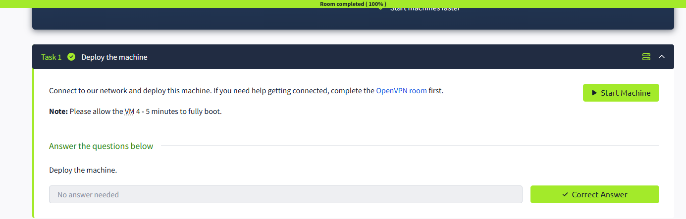
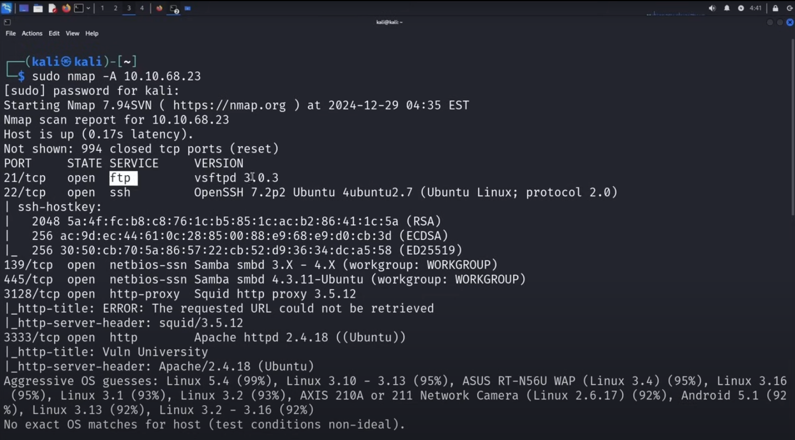

# 🔓 TryHackMe Lab Walkthrough – Vulnversity  

## 📌 Introduction  
This project is part of the **Offensive Pentesting Path** on [TryHackMe](https://tryhackme.com).  
The lab we are working on is **Vulnversity**, a beginner-friendly CTF room focused on web vulnerabilities, privilege escalation, and enumeration.  

For this walkthrough, I am using **Kali Linux on VirtualBox**.  
- Connection to the TryHackMe network is done via **OpenVPN**.  
- Alternatively, you can use the **AttackBox** (browser-based Kali provided by THM), which is already connected to the lab environment.  

---

## 🚀 Step 1: Deploying the Target Machine  
The first step is to deploy the vulnerable machine provided by TryHackMe.  

- Start the machine from the THM portal.  
- Wait **1 minute** for the target IP to appear.  
- Allow **4–5 minutes** for the machine to fully boot.  

📷 **Screenshot:**  
  


## 🔎 Step 2: Enumeration with Nmap  
After the target machine was up, I conducted an **Nmap scan** to identify open ports and running services.  
I used the `-A` flag since it provides OS detection, service versions, and script scanning in one command.  

```bash
sudo nmap -A 10.10.68.23
```
📷 **Screenshot:**



Results from the scan:

Port 21/tcp → FTP (vsftpd 3.0.3)

Port 22/tcp → SSH (OpenSSH 7.2p2)

Port 139, 445/tcp → SMB service running

Port 3128/tcp → Squid HTTP proxy

Port 3333/tcp → Apache web server (Vuln University)

👉 The web server on port 3333 stands out as a potential entry point for exploitation.


## 🌐 Step 3: Initial Web Enumeration  

After identifying that **port 3333** was running an Apache web server, I visited the site in my browser:  

📷 **Screenshot:**  
  

The website displayed a landing page for "Vuln University."  

At first glance, there were no visible vulnerabilities on the main page.  
However, I suspected that hidden directories or files might exist, which could potentially expose sensitive information or lead to exploitation.  


## 🔍 Step 4: Directory Bruteforcing  

To identify hidden directories on the Apache server running on port **3333**, I performed a **Gobuster directory scan** using the `common.txt` wordlist from Seclists.  

### Command Used:
```bash
gobuster dir -u http://10.10.68.23:3333 -w /usr/share/wordlists/seclists/Discovery/Web-Content/common.txt
```


The scan results showed the following directories/files:  

- `.htpasswd` → **403 Forbidden**  
- `.htaccess` → **403 Forbidden**  
- `.hta` → **403 Forbidden**  
- `/css` → **301 Redirect**  
- `/fonts` → **301 Redirect**  
- `/images` → **301 Redirect**  
- `/index.html` → **200 OK**  
- `/internal` → **301 Redirect**  
- `/js` → **301 Redirect**  
- `/server-status` → **403 Forbidden**  

📷 **Screenshot:**  
  

After manually visiting the directories, I discovered that the **`/internal` directory** exposed an **upload functionality**.  


## 🛠 Step 5: Discovering File Upload Restrictions  

After accessing the **`/internal`** directory, I found an **upload page**.  

📷 **Screenshot:**  
  

I attempted to upload a **PHP reverse shell** payload (`rev.php`).  
However, the application **rejected the file format**, indicating that PHP files are not allowed.  

This shows that the upload functionality has **file type restrictions** in place.  
➡️ The next step will be to identify which file formats are supported.  


## 🛠 Step 6: Capturing the File Upload Request with BurpSuite  

To analyze the file upload restriction, I configured **FoxyProxy** to redirect traffic through **BurpSuite** on port `8080`.  

- Opened BurpSuite and enabled **Proxy → Intercept ON**.  
- Went back to the web application and attempted to upload the **PHP reverse shell file** again.  
- BurpSuite successfully captured the HTTP request of the file upload.  

📷 **Screenshot:**  
  

The intercepted request clearly shows the payload:  

```http
POST /internal/index.php HTTP/1.1
Host: 10.10.68.23:3333
Content-Disposition: form-data; name="file"; filename="rev.php"
Content-Type: application/x-php
```

From this request, I confirmed that the application is filtering uploads based on **file extension** and/or **MIME type**.  
➡️ The next step is to test alternate file extensions to bypass this restriction.  


## 🛠 Step 7: Bypassing File Upload Restriction with BurpSuite Intruder  

To bypass the file upload filter, I used **BurpSuite Intruder** to brute-force common PHP extensions.  

### Process:
1. Captured the file upload request in Burp and sent it to **Intruder**.  
2. Selected the filename parameter (`rev.php`) and marked it with **§**.  
3. Added the following payloads:  
   ```
   php
   php1
   php2
   php5
   phtml
   ```
4. Ran the **Sniper attack** to test each extension.  

### 📷 Screenshot:  
  

### 🔑 Findings:
- `.php`, `.php1`, `.php2`, and `.php5` → Blocked.  
- ✅ `.phtml` → Successfully uploaded with **200 OK** and `Success` message.  

➡️ This confirmed that `.phtml` is an **allowed extension** on the server, enabling us to upload a malicious reverse shell for exploitation.  


## 🛠 Step 8: Uploading Reverse Shell and Gaining Foothold  

After identifying that `.phtml` files are allowed, I prepared a reverse shell.  

### 1️⃣ Creating the Reverse Shell File  
I copied the PHP reverse shell contents from `rev.php` into a new file named `rev.phtml`:  

```bash
cp rev.php rev.phtml
```

### 2️⃣ Uploading the Reverse Shell  
- Uploaded `rev.phtml` through the vulnerable upload form.  
- The upload was successful (validated earlier with BurpSuite Intruder).  

### 3️⃣ Starting Netcat Listener  
On a separate terminal, I started a listener to catch the reverse shell:  

```bash
nc -lvnp 1234
```

### 4️⃣ Locating the Uploaded File  
To identify where the uploaded file was stored, I performed another directory brute-force against the `/internal/` path.  
- Found that the file was saved under:  

```
/internal/uploads/
```

### 5️⃣ Executing the Reverse Shell  
I accessed the uploaded file in the browser:  

```
http://<target-ip>:3333/internal/uploads/rev.phtml
```

📷 **Screenshot**
[dir bruteforcing showing uploads directory](./Screenshots/directory_bruteforcing_in_internal_directory.png)
[uploads page showing rev.phtml file](./Screenshots/Uploads_directory_showing_rev.phtml.png)

### ✅ Result  
After triggering the file, I received a reverse shell connection back on the listener terminal.  


